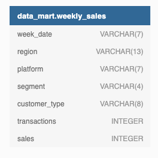
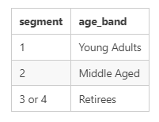
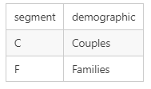

# SQL-DannyMa-Challenge05

## Introduction
Data Mart is Danny’s latest venture and after running international operations for his online supermarket that specializes in fresh produce. In June 2020 - large-scale supply changes were made at Data Mart. All Data Mart products now use sustainable packaging methods in every single step from the farm all the way to the customer. Danny needs help quantifying the impact of this change on the sales performance of Data Mart and its separate business areas.
The key business questions he wants answers for as follows:

- What was the quantifiable impact of the changes introduced in June 2020?
- Which platform, region, segment, and customer types were the most impacted by this change?
- What can we do about the future introduction of similar sustainability updates to the business to minimize the impact on sales?

## Data Overview

There is only a single table for this case study: data_mart.weekly_sales. The Entity Relationship Diagram is shown below with the data types.

- Data Mart has international operations using a multi-region strategy.
- Data Mart has both, a retail and online platform in the form of a Shopify storefront to serve their customers.
- Customer segment and customer_type data relate to personal age and demographics information shared with Data Mart.
- Transactions is the count of unique purchases made through Data Mart and sales is the actual dollar amount of purchases
- Each record in the dataset is related to a specific aggregated slice of the underlying sales data rolled up into a week_date value which represents the start of the sales week.

## Case Study Questions
The following case study questions require some data-cleaning steps before we start to unpack Danny’s key business questions in more depth.

### 1. Data Cleansing Steps
In a single query, perform the following operations and generate a new table in the data_mart schema named clean_weekly_sales:

- Convert the week_date to a DATE format
- Add a week_number as the second column for each week_date value, for example, any value from the 1st of January to the 7th of January will be 1, the 8th to 14th will be 2, etc
- Add a month_number with the calendar month for each week_date value as the 3rd column
- Add a calendar_year column as the 4th column containing either 2018, 2019 or 2020 values
- Add a new column called age_band after the original segment column using the following mapping on the number inside the segment value

Add a new demographic column using the following mapping for the first letter in the segment values:

- Ensure all null string values with an "unknown" string value in the original segment column as well as the new age_band and demographic columns
- Generate a new avg_transaction column as the sales value divided by transactions rounded to 2 decimal places for each record

### 2. Data Exploration
- What day of the week is used for each week_date value?
- What range of week numbers are missing from the dataset?
- How many total transactions were there for each year in the dataset?
- What is the total sales for each region for each month?
- What is the total count of transactions for each platform
- What is the percentage of sales for Retail vs Shopify for each month?
- What is the percentage of sales by demographic for each year in the dataset?
- Which age_band and demographic values contribute the most to Retail sales?
- Can we use the avg_transaction column to find the average transaction size for each year for Retail vs Shopify? If not - how would you calculate it instead?

### 3. Before & After Analysis
This technique is usually used when we inspect an important event and want to inspect the impact before and after a certain point in time.

Taking the week_date value of 2020-06-15 as the baseline week where the Data Mart sustainable packaging changes came into effect.
We would include all week_date values for 2020-06-15 as the start of the period after the change and the previous week_date values would be before
Using this analysis approach - answer the following questions:

- What are the total sales for the 4 weeks before and after 2020-06-15? What is the growth or reduction rate in actual values and percentage of sales?
- What about the entire 12 weeks before and after?
- How do the sales metrics for these 2 periods before and after compare with the previous years in 2018 and 2019?

## SQL syntax solutions

-- Question 1

CREATE TABLE cleaned_weekly_sales AS 
SELECT *,
TO_CHAR(week_date, 'WW') AS week_number,
EXTRACT('month' FROM week_date) AS month_number,
EXTRACT('year'FROM week_date) AS calendar_year,
CASE 
	WHEN RIGHT(segment,1)='1' THEN 'Young Adults'
	WHEN RIGHT(segment,1)='2' THEN 'Middle Aged'
	WHEN RIGHT(segment,1) IN ('3','4') THEN 'Retirees'
	ELSE segment END AS age_band,
CASE 
	WHEN LEFT(segment,1)='C' THEN 'Couples'
	WHEN LEFT(segment,1)='F' THEN 'Families'
	ELSE segment END AS demographic,
ROUND(sales/transactions::NUMERIC,2) AS avg_transaction
FROM (
	SELECT CONCAT('20'||SPLIT_PART(week_date,'/',3),
			'-',SPLIT_PART(week_date,'/',2),
			'-',SPLIT_PART(week_date,'/',1)
			)::DATE AS week_date,
	region,
	platform,
	CASE WHEN segment = 'null' OR segment IS NULL THEN 'unknown'
	ELSE segment END AS segment,
	customer_type,
	transactions,
	sales
	FROM data_mart.weekly_sales 
) AS clean_weekdate;

-- Question 2a

SELECT DISTINCT TO_CHAR(week_date, 'day') AS day_of_week
FROM cleaned_weekly_sales;

-- Question 2b

SELECT * FROM GENERATE_SERIES(1,53) AS missing_week_numbers
WHERE missing_week_numbers NOT IN (
  		SELECT DISTINCT cws.week_number FROM clean_weekly_sales cws) 
ORDER BY missing_week_numbers;

-- Question 2c

SELECT calendar_year, sum(transactions) AS total_transactions
FROM cleaned_weekly_sales
GROUP BY calendar_year
ORDER BY total_transactions;

-- Question 2d

SELECT region, 
DATE_TRUNC('month', week_date) AS month,
SUM(sales) AS total_sales
FROM cleaned_weekly_sales
GROUP BY 1,2 ORDER BY 1,2;

-- Question 2e

SELECT platform, 
SUM(transactions) AS total_transactions
FROM cleaned_weekly_sales
GROUP BY 1;

-- Question 2f

SELECT *,
ROUND(shopify_sales/total_sales::NUMERIC,2) AS shopify_percent,
ROUND(retail_sales/total_sales::NUMERIC,2) AS retail_percent
FROM (
	SELECT 
	DATE_TRUNC('month', week_date) AS month,
	SUM(CASE WHEN platform = 'Shopify' THEN sales END) AS shopify_sales,
	SUM(CASE WHEN platform = 'Retail' THEN sales END) AS retail_sales,
	SUM(sales) AS total_sales
	FROM cleaned_weekly_sales
	GROUP BY 1 ORDER BY 1) AS sales_split;

-- Question 2g

SELECT *,
ROUND(couples_sales/total_sales::NUMERIC,2) AS couples_percent,
ROUND(family_sales/total_sales::NUMERIC,2) AS family_percent,
ROUND(unknown_sales/total_sales::NUMERIC,2) AS unknown_percent
FROM (
	SELECT 
	EXTRACT(YEAR FROM week_date) AS year,
	SUM(CASE WHEN demographic = 'Couples' THEN sales END) AS couples_sales,
	SUM(CASE WHEN demographic = 'Families' THEN sales END) AS family_sales,
	SUM(CASE WHEN demographic = 'unknown' THEN sales END) AS unknown_sales,
	SUM(sales) AS total_sales
	FROM cleaned_weekly_sales
	GROUP BY 1 ORDER BY 1) AS sales_split;

-- Question 2h

SELECT CONCAT(demographic, '-', age_band) AS demographic_age,
SUM(sales) AS total_sales,
RANK() OVER (ORDER BY SUM(sales) DESC) AS most_contribution
FROM cleaned_weekly_sales
WHERE platform = 'Retail'
GROUP BY 1 ORDER BY 2 DESC;

-- Question 2i

SELECT calendar_year, platform, 
  ROUND(AVG(avg_transaction), 2),
  ROUND(SUM(sales)::NUMERIC/SUM(transactions), 2) AS proper_avg_transactions
FROM cleaned_weekly_sales
GROUP BY calendar_year, platform 
ORDER BY calendar_year, platform;

-- Question 3a

WITH four_weeks_before AS (
  SELECT DISTINCT week_date
  FROM cleaned_weekly_sales
  WHERE week_date BETWEEN (TO_DATE(‘2020–06–15’, ‘yy/mm/dd’) — interval ‘4 weeks’) 
  AND (TO_DATE(‘2020–06–15’, ‘yy/mm/dd’) — interval ‘1 week’)
),
four_weeks_after AS (
  SELECT DISTINCT week_date
  FROM cleaned_weekly_sales
  WHERE week_date BETWEEN TO_DATE(‘2020–06–15’, ‘yy/mm/dd’) AND 
  (TO_DATE(‘2020–06–15’, ‘yy/mm/dd’) + interval ‘3 weeks’) 
),
summations AS (
  SELECT SUM(CASE 
        WHEN week_date in (select * from four_weeks_before) THEN sales 
      END
    ) AS four_weeks_before,
    SUM(CASE 
        WHEN week_date in (select * from four_weeks_after) THEN sales 
      	END) AS four_weeks_after
  FROM cleaned_weekly_sales)
SELECT *,
  four_weeks_after — four_weeks_before AS variance,
  ROUND(
    100 * (four_weeks_after - four_weeks_before)::numeric/four_weeks_before, 2
  ) AS percentage_change
FROM summations;

-- Question 3b

WITH twelve_weeks_before AS (
  SELECT DISTINCT week_date
  FROM cleaned_weekly_sales
  WHERE week_date BETWEEN 
    (TO_DATE(‘2020–06–15’, ‘yy/mm/dd’) — interval ’12 weeks’) AND 
    (TO_DATE(‘2020–06–15’, ‘yy/mm/dd’) — interval ‘1 week’)
  ),
  twelve_weeks_after AS (
  SELECT DISTINCT week_date
  FROM cleaned_weekly_sales
  WHERE week_date BETWEEN 
    TO_DATE(‘2020–06–15’, ‘yy/mm/dd’) AND 
    (TO_DATE(‘2020–06–15’, ‘yy/mm/dd’) + interval ’11 weeks’) 
  ),
  summations AS (
  SELECT SUM(
      CASE 
        WHEN week_date in (select * from twelve_weeks_before) THEN sales 
      END
    ) AS twelve_weeks_before,
  SUM(
      CASE 
        WHEN week_date in (select * from twelve_weeks_after) THEN sales 
      END
    ) AS twelve_weeks_after
  FROM cleaned_weekly_sales
  )
SELECT *,
  twelve_weeks_after - twelve_weeks_before AS variance,
  ROUND(100 * (twelve_weeks_after - twelve_weeks_before)::numeric/twelve_weeks_before, 2) AS percentage_change
FROM summations;

-- Question 3c

WITH cte AS (
  SELECT DISTINCT week_number FROM cleaned_weekly_sales
  WHERE week_date = '2020-06-15'
 ),
 four_weeks_before AS (
  SELECT DISTINCT week_date
  FROM cleaned_weekly_sales
  WHERE week_number BETWEEN (SELECT week_number FROM cte) - 4 AND (SELECT week_number FROM cte) - 1
 ),
 four_weeks_after AS (
  SELECT DISTINCT week_date
  FROM cleaned_weekly_sales
  WHERE week_number BETWEEN (SELECT week_number FROM cte) AND (SELECT week_number FROM cte) + 3
 ),
 summations AS (
  SELECT calendar_year, SUM(CASE WHEN week_date IN (SELECT * FROM four_weeks_before) THEN sales END) AS four_weeks_before,
  SUM(CASE WHEN week_date IN (SELECT * FROM four_weeks_after) THEN sales END) AS four_weeks_after
  FROM cleaned_weekly_sales
  GROUP BY calendar_year
 )
 SELECT *,
  four_weeks_after - four_weeks_before AS variance,
  ROUND(100 * (four_weeks_after - four_weeks_before)::numeric/four_weeks_before, 2) AS percentage_change
 FROM summations
 ORDER BY calendar_year;
 
